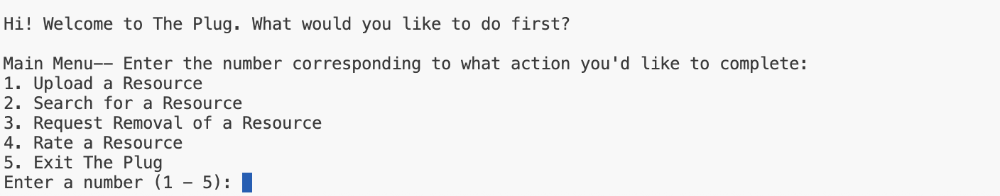

# the-plug
Welcome to the plug!! A Java-based resource management tool for 5C students on free, reduced fare prices on events,items,services, and more. 5C students can add, search, rate and remove resources interacting with our program in the hope to make college a bit more budget friendly! 

## Features 〜〜〜〜〜〜〜〜〜〜〜〜〜〜〜

- Add/upload resources with various attributes (name, school, type,ect.) 
-Remove resources based off system of requests, after a set number of removal requests is met (5 requests) 
-Search resources by name or category or tag 
-Rate resources on a scale of 1.0 to 5.0

## Feature 1. Upload

*In the main menu : type in (1) that correlates with upload resource*

1. Enter the name of the resource you would like to add

.png>)
2. Select which school based off what is provided for you Ex: (Claremont McKenna, Harvey Mudd..ect) 
The schools are in alphabet order and you will have options 1-6 to choose what number which correlates to the school provided. 

3.Based off of the cost options provided which will be presented with numbers 1-5. Choose a number that correlates to the cost of the resource you are uploading.
Ex. (Free, 1-10, 10-20..ect)

4. Based off of the type options provided which will be presented with numbers 1-7. Choose a number that correlates to the type of the resource you are uploading.
Ex. (Activity,Event,Fare Reduction..ect)

5. Based off of the genre options provided which will be presented with numbers 1-12. Choose a number that correlates to the genre of the resource you are uploading.
Ex. (Academic, Career, Entertainment..ect)

6. (OPTIONAL)Add tags to your resource but put commos in between multiple tags
Ex. (fli, AAMP, disability resources) 

7.(OPTIONAL) Add a contact for your resource

8. (OPTIONAL) Add the date of when this resource was last used or last active 

## Feature 2. Remove a Resource & Removal Request
If you find that a resource is outdated or you used it and would like to submit a removal request this was meant for you! 
*in the main menu type 3 that correlates with removal request*

The request Removal resource will record your request and after 5 requests for removal of this resource have been made then the resource will be deleted from THE PLUG.

1. Choose 0 or 1 depending on what correaltes with your choice : 
If you choose to submit a remove request..write the resource name and double check that you did not misspell it or capatilize it incorrectly ! 

3. You should see on your terminal : "Resource resource-name has been removed" if there has been at least five requests 

If there has been less than five requests then it should appear remove request has been recorded with the number of remove requests 

## Feature 3. Searching for resources

Are you looking for a free/price reduced resource? You came to the right place. 
Search for the resource you are looking for by school, type, cost, genre, or by tags.

1. *Start to search by choosing 2 from the menu*
     - To Search By Name:
     
     
     - To Search By Categorization
     
     

     - To Search by Tags
     

2. Based off what is shown to you in the menu choose the numbers that correlate to the categories you wish to search by 

## Feature 4. Rate 
Tell us what you think about these resources by rating them from 1.0 to 5.0. 

Our rate feature allows multiple people rate a resource and when you want to get that resource it will give you the average rating of each resource based off of these. 

1. from the menu choose number 4 which correlates with making a rating! 
2. type in your number rating which is between 1.0 to 5.0
3. You are done, thank you for your feedback!

Caveat: Also, you are welcome to explore our resources based off of the highest/top rating in the serach option in the menu (number 2)!

Now you are ready equipped to start using THE PLUG!!

## Getting Started  ( ˘ ³˘)♥━━━♡━━━━━━♡━━━♥(˘ε ˘ )

## Prerequesites

1. Java 8 or higher 
2. A text editor or IDE (e.g IDEA, Eclipse, VS Code)

## Running the Plug 

1. Make sure to run the main in the == Plug Manager class ==. 

### Contributing 
Feel free to submit pull requests and provide feedback. If you have any suggestions or find bugs, please open an issue in the GitHub repositiory.
